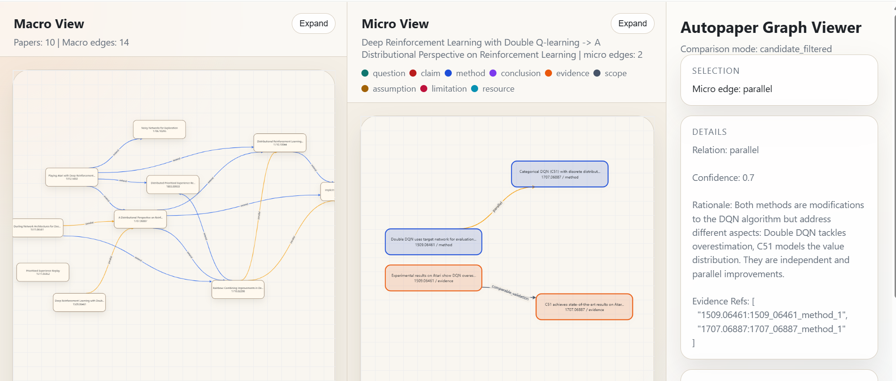

# autopaper

`autopaper` is a local academic paper analysis tool for processing paper collections and generating cross-paper relationship graphs.

The system accepts a text input list, ingests arXiv papers or local PDF files, converts paper content into normalized markdown, uses an LLM to extract structured academic units, and constructs both macro-level and micro-level relationship views across papers.

## Overview

The workflow is organized as the following stages:

1. Input list parsing
2. Paper content acquisition
3. Content normalization to markdown
4. Structured unit extraction
5. Cross-paper relation inference
6. Graph export and local visualization

The generated graph contains two coordinated views:

- `macro`: paper-to-paper relations for high-level structure
- `micro`: unit-to-unit relations for fine-grained semantic support

## Supported Inputs

Each line of the input text file may contain one paper entry.

Supported entry types:

- arXiv ID
- arXiv abstract URL
- local PDF file path

Examples:

```txt
2504.01848
https://arxiv.org/abs/2410.07095
D:\papers\example.pdf
```

The content ingestion behavior is:

- arXiv papers are fetched from the arXiv source endpoint
- LaTeX source packages are unpacked and converted through the LaTeX pipeline
- arXiv source responses that are actually PDF files are routed through the PDF pipeline
- local PDF files are routed directly through the PDF pipeline

## Pipeline Behavior

The runtime converts the input list into normalized markdown, extracts structured units, and builds macro and micro relationship graphs.

LaTeX papers are downloaded and converted from source.
PDF papers are parsed with `PyMuPDF` and lightly cleaned before extraction.

## Extraction Ontology

The per-paper extraction target uses the following unit types:

- `research_question`
- `core_claim`
- `method`
- `formal_conclusion`
- `evidence`
- `assumption`
- `limitation`
- `scope`
- `resource`

General extraction conventions:

- a paper may contain multiple units of the same type
- `summary` is compact and relation-oriented
- `text` preserves the substantive content with more detail
- `sources` preserve traceability to the original paper text
- `evidence` units may reference supported claims or conclusions through `supports`
- `resource` units preserve concrete names when benchmarks, datasets, models, codebases, or tools are explicitly stated

## Relationship Graph

The graph is exported in two layers.

### Macro View

The macro view represents paper-to-paper relations.

Supported macro labels:

- `support`
- `conflict`
- `extend`
- `parallel`
- `basis`
- `complement`
- `apply`

### Micro View

The micro view represents cross-paper unit-to-unit relations.

Supported micro labels:

- `support`
- `conflict`
- `extend`
- `parallel`
- `basis`
- `complement`
- `apply`
- `addresses_limitation_of`
- `comparable_validation`

Macro edges are derived from accepted micro edges.

## Project Layout

- `app/`: pipeline, providers, config handling, and graph export
- `config/`: configuration templates and local runtime config
- `data/inputs/`: input text files
- `data/cache/`: downloaded archives, unpacked sources, and cached PDFs
- `data/outputs/`: run outputs
- `schemas/`: JSON schemas for extraction and graph artifacts
- `skills/`: prompt-side skill documents used by the LLM workflow

## Requirements

- Python `3.10` or newer
- network access for arXiv downloads and LLM API calls
- a valid LLM API key

Runtime dependency:

- `PyMuPDF`

## Installation

Install the project in the current environment:

```powershell
pip install -e .
```

If `PyMuPDF` is not present, install it in the same environment:

```powershell
pip install PyMuPDF
```

## Configuration

Copy the example configuration file:

- `config/autopaper_config.example.json`

Create a local runtime configuration file:

- `config/autopaper_config.json`

Example:

```json
{
  "llm": {
    "provider": "deepseek-compatible",
    "model": "deepseek-v4-flash",
    "api_key": "YOUR_API_KEY",
    "base_url": "https://api.deepseek.com",
    "json_mode": "json_object",
    "max_tokens": 4000,
    "timeout_seconds": 180,
    "retries": 3
  }
}
```

`json_mode` controls how the runtime asks the model for structured JSON output:

- `auto`: choose a default based on provider or model name
- `json_schema`: send a schema-style structured output request
- `json_object`: request a plain JSON object response
- `prompt_only`: rely on prompt instructions only and do not send `response_format`

## Running the Tool

### Basic Command

```powershell
python -m app.cli data\inputs\example_arxiv_list.txt
```

### With Explicit Config

```powershell
python -m app.cli data\inputs\example_arxiv_list.txt --config config\autopaper_config.json
```

### With Explicit Output Directory

```powershell
python -m app.cli data\inputs\example_arxiv_list.txt --output-dir data\outputs\my_run --config config\autopaper_config.json
```

### Installed Entry Point

```powershell
autopaper data\inputs\example_arxiv_list.txt
```

### Command-Line Arguments

- `input_txt`: path to the input text file
- `--output-dir`: explicit run directory or base output directory
- `--cache-dir`: cache location, default `data/cache`
- `--config`: path to the runtime config file

## Example Run

The following screenshot shows a batch command-line run with progress output:



## Output Structure

If `--output-dir` is not specified, each run is written to a timestamped directory under `data/outputs/`.The graph is  in  data/outputs/graph/index.html

Example: 

```txt
data/outputs/run_20260519_183000，
```

Typical run contents:

- `manifest.json`
- `markdown/`
- `extractions/`
- `graphs/`
- `debug/`

### Main Output Files

- `manifest.json`: per-paper workflow summary
- `markdown/*.md`: normalized paper markdown
- `extractions/*.json`: structured paper units
- `graphs/graph.json`: macro and micro graph payload
- `graphs/index.html`: local graph viewer（entrance）
- `graphs/macro_graph.html`: macro-only view
- `graphs/micro_graph.html`: micro-only view
- `graphs/debug/`: relation inference debug artifacts

## Input Preparation

Example input files:

- `data/inputs/example_arxiv_list.txt`
- `data/inputs/single_arxiv.txt`

## Environment Override

The runtime config path may also be provided through:

- `AUTOPAPER_CONFIG`
